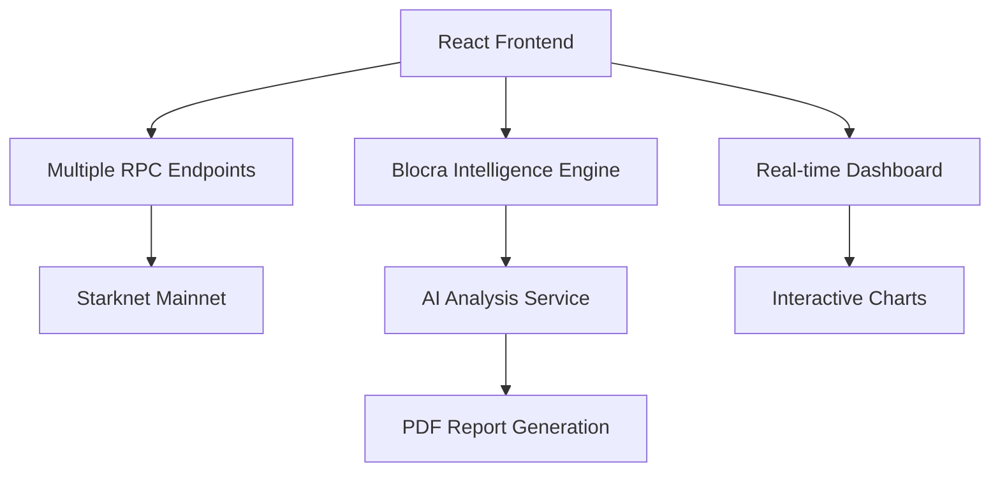

<div align="center">

# 🚀 BloDI

### Next-Generation Analytics & Intelligence Platform for Starknet

[](https://opensource.org/licenses/MIT)
[](https://blodi-suite.vercel.app/)
[](https://starknet.io/)
[](https://typescriptlang.org/)
[](https://reactjs.org/)

[🌐 **Live Demo**](https://blodi-suite.vercel.app/) • [📖 **Documentation**](#-features) • [🚀 **Deploy Now**](#-quick-deploy)

</div>

---

## 🌟 **What is BloDI?**

**BloDI (Blockchain Data Intelligence)** is a production-ready, enterprise-grade platform that revolutionizes how developers, analysts, and businesses interact with the Starknet ecosystem. Combining powerful real-time analytics with AI-powered intelligence reports, it's the ultimate toolkit for blockchain data analysis and business intelligence.

### 🎯 **Core Value Propositions**

- 📊 **Real-Time Analytics**: Live Starknet data with interactive visualizations and comprehensive dashboards
- 🤖 **AI-Powered Intelligence**: Blocra Intelligence Engine generates professional business reports with strategic insights
- 📄 **Professional Reports**: Export detailed PDF intelligence reports with risk assessment and recommendations
- 🔍 **Contract Analysis**: Deep dive into any Starknet contract with comprehensive event analysis
- ⚡ **Lightning Fast**: Optimized performance with real-time RPC data integration

---

## ✨ **Key Features**

<table>
<tr>
<td width="50%">

### 🔍 **Contract Intelligence**
- **Real-Time Event Analysis**: Live contract event monitoring and decoding
- **User Segmentation**: Whale, Bot, DAO, and Regular User classification
- **Performance Metrics**: Gas analysis, success rates, and efficiency scoring
- **Visual Dashboards**: Interactive charts and KPI cards with real blockchain data
- **Export Capabilities**: CSV, JSON, and dashboard image exports

</td>
<td width="50%">

### 🤖 **AI-Powered Reports**
- **Blocra Intelligence Engine**: Advanced AI analysis of contract data
- **Professional PDF Reports**: Business-ready intelligence documents
- **Risk Assessment**: Technical, operational, and market risk analysis
- **Strategic Recommendations**: Actionable insights for growth and optimization
- **Executive Summaries**: C-level ready business intelligence

</td>
</tr>
<tr>
<td width="50%">

### 📊 **Analytics Dashboard**
- **Live Starknet Data**: Real-time RPC integration with multiple endpoints
- **Interactive Visualizations**: Pie charts, bar charts, line graphs, and gauges
- **Custom Metrics**: Gas usage, user retention, transaction patterns
- **Cross-Contract Analysis**: Multi-contract interaction tracking
- **Performance Monitoring**: Success rates, error analysis, and reliability scoring

</td>
<td width="50%">

### 🔒 **Enterprise Features**
- **Production Ready**: Deployed and tested for enterprise use
- **Multiple RPC Endpoints**: Failover support for high availability
- **Professional UI**: Clean, modern interface built with shadcn/ui
- **Responsive Design**: Works seamlessly on desktop and mobile
- **Error Handling**: Comprehensive error management and user feedback

</td>
</tr>
</table>

---

## 🚀 **Quick Start**

### Prerequisites
- Node.js 18+
- pnpm (recommended) or npm

### Local Development

```bash
# Clone the repository
git clone https://github.com/Ndifreke000/BloDI.git
cd BloDI

# Install dependencies
pnpm install

# Start development server
pnpm run dev

# Build for production
pnpm run build
```

### Environment Variables

```env
# Starknet RPC Configuration
VITE_STARKNET_RPC_URL=https://starknet-mainnet.public.blastapi.io

# Optional: Additional RPC endpoints are configured in the app
# The app automatically uses multiple RPC endpoints with failover
```

---

## 🎮 **How to Use BloDI**

### 1. **Contract Analysis**
```
1. 🔍 Enter Contract Address → Input any Starknet mainnet contract
2. 📝 Add Contract Name → Provide a custom name for your analysis
3. 🚀 Fetch Events → Retrieve and analyze contract events
4. 📊 View Dashboard → Explore interactive analytics and metrics
```

### 2. **Generate Intelligence Reports**
```
1. 📊 Complete Contract Analysis → Ensure you have fetched contract data
2. 🤖 Generate AI Report → Click "Generate PDF Report" 
3. ⏳ Wait for Analysis → Blocra Intelligence Engine processes the data
4. 📄 Download PDF → Get your professional intelligence report
```

### 3. **Export and Share**
```
1. 📊 Export Data → Download CSV/JSON of contract events
2. 📸 Export Dashboard → Save dashboard as high-quality image
3. 📄 Share Reports → Professional PDF reports for stakeholders
```

---

## 🏗️ **Architecture Overview**



### 🛠️ **Tech Stack**

| Layer | Technology | Purpose |
|-------|------------|----------|
| **Frontend** | React + Vite + TypeScript | Modern, fast UI development |
| **Styling** | Tailwind CSS + shadcn/ui | Beautiful, responsive design |
| **Charts** | Recharts | Interactive data visualizations |
| **Blockchain** | Starknet RPC + starknet.js | Real-time blockchain data |
| **AI Engine** | Blocra Intelligence Engine | Advanced contract analysis |
| **Reports** | jsPDF | Professional PDF generation |
| **Deployment** | Vercel | Global CDN deployment |

---

## 📊 **Sample Intelligence Report Sections**

BloDI generates comprehensive reports with these sections:

- **📋 Contract Information**: Address, type, deployment details, current status
- **📈 Executive Summary**: Key performance indicators and strategic assessment  
- **⚡ Performance Analysis**: Gas efficiency, reliability metrics, user retention
- **💼 Business Insights**: User behavior patterns, market position, revenue implications
- **⚠️ Risk Assessment**: Technical, operational, and market risk factors
- **🔧 Technical Analysis**: Event architecture, cross-contract interactions, health indicators
- **🎯 Market Position**: Competitive analysis, growth trajectory, market opportunity
- **📋 Strategic Recommendations**: Immediate actions, improvements, and long-term strategy

---

## 🎯 **User Segments Explained**

BloDI automatically classifies contract users into segments:

- **🐋 Whale**: Large holders making high-value transactions with substantial holdings
- **🤖 Bot**: Automated programs performing arbitrage, market making, or trading strategies  
- **🏛️ DAO**: Decentralized organizations managing protocol operations and governance
- **👤 Regular User**: Individual retail users making standard transactions and interactions

---

## 🌍 **Production Deployment**

### One-Click Deployment

[](https://vercel.com/new/clone?repository-url=https://github.com/Ndifreke000/BloDI)

### Manual Deployment

```bash
# Build the application
pnpm run build

# Deploy to your preferred platform
# The app is optimized for Vercel, Netlify, or any static hosting
```

---

## 📈 **Performance Metrics**

<div align="center">

| Metric | Value | Status |
|--------|-------|--------|
| **Build Time** | <30s | 🟢 Fast |
| **Bundle Size** | Optimized | 🟢 Efficient |
| **RPC Failover** | 4 Endpoints | 🟢 Reliable |
| **Report Generation** | <5s | 🟢 Quick |
| **Mobile Support** | Responsive | 🟢 Compatible |

</div>

---

## 🔧 **Development**

### Project Structure
```
src/
├── components/          # Reusable UI components
├── pages/              # Main application pages
├── services/           # Business logic and API services
│   ├── AIAnalysisService.ts    # Blocra Intelligence Engine
│   ├── PDFReportService.ts     # PDF generation
│   └── StarknetRPCService.ts   # Blockchain data fetching
├── lib/                # Utility functions
└── styles/             # Global styles and themes
```

### Key Services

- **AIAnalysisService**: Generates comprehensive business intelligence reports
- **PDFReportService**: Creates professional PDF documents with proper formatting
- **StarknetRPCService**: Handles real-time blockchain data with failover support

---

## 🤝 **Contributing**

We welcome contributions! Here's how to get started:

1. **Fork** the repository
2. **Create** a feature branch (`git checkout -b feature/amazing-feature`)
3. **Commit** your changes (`git commit -m 'Add amazing feature'`)
4. **Push** to the branch (`git push origin feature/amazing-feature`)
5. **Open** a Pull Request

---

## 📄 **License**

```
MIT License

Copyright (c) 2025 BloDI - Blockchain Data Intelligence

Permission is hereby granted, free of charge, to any person obtaining a copy
of this software and associated documentation files (the "Software"), to deal
in the Software without restriction, including without limitation the rights
to use, copy, modify, merge, publish, distribute, sublicense, and/or sell
copies of the Software, and to permit persons to whom the Software is
furnished to do so, subject to the following conditions:

The above copyright notice and this permission notice shall be included in all
copies or substantial portions of the Software.

THE SOFTWARE IS PROVIDED "AS IS", WITHOUT WARRANTY OF ANY KIND, EXPRESS OR
IMPLIED, INCLUDING BUT NOT LIMITED TO THE WARRANTIES OF MERCHANTABILITY,
FITNESS FOR A PARTICULAR PURPOSE AND NONINFRINGEMENT. IN NO EVENT SHALL THE
AUTHORS OR COPYRIGHT HOLDERS BE LIABLE FOR ANY CLAIM, DAMAGES OR OTHER
LIABILITY, WHETHER IN AN ACTION OF CONTRACT, TORT OR OTHERWISE, ARISING FROM,
OUT OF OR IN CONNECTION WITH THE SOFTWARE OR THE USE OR OTHER DEALINGS IN THE
SOFTWARE.
```

---

<div align="center">

**Built with ❤️ for the Starknet Community**

[🌐 Website](https://blodi-suite.vercel.app/) • [📖 Docs](#-features) • [🐦 Twitter](https://twitter.com/blodi_suite) • [💬 Discord](https://discord.gg/blodi)

⭐ **Star us on GitHub** if you find BloDI useful for your blockchain analytics!

</div>